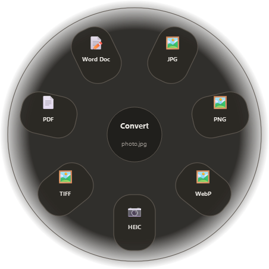
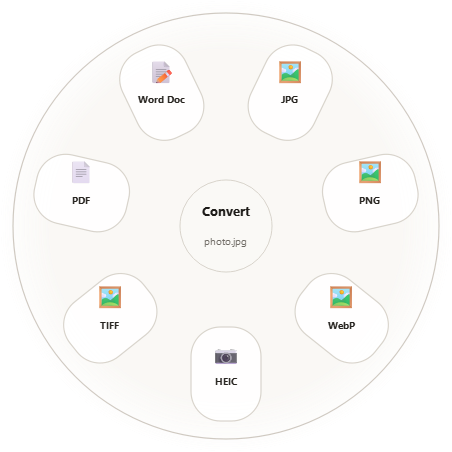

# Tangerine for Windows

A drag-to-convert desktop tray utility for Windows 11. Hold **Shift** while
dragging files out of File Explorer and a radial wheel appears under the
cursor: drop the files onto a petal to convert them. Hold **Alt+Shift**
instead and the same wheel offers file tools — compress, crop, trim, redact,
collage, metadata, QR reading and more.



<p align="center">
  
</p>

> **Disclaimer:** This is an independent, community reimplementation of the
> drag-to-convert *idea* of the macOS app **Tangerine** by **thmmhnsn**. It is
> **not affiliated with, endorsed by, or connected to** the original author or
> app. This project is a from-scratch Python/Qt reimplementation for Windows;
> the name is used only to describe the interaction it was inspired by, and the
> icon is an original re-creation of a citrus-wheel concept.

## What it is

Tangerine for Windows is a Python 3 + PySide6 tray application. It watches for
drag sessions in Explorer (using public Win32 state and the OLE drag
clipboard — no input hooks) and shows a fixed radial picker at the drop point.
Choosing a petal starts a background job with a progress window, and the output
is written as a **new sibling file**: source files are never modified, and the
drop itself is copy-only.



The wheel follows the Windows dark/light theme.

## Features

### Conversions (Shift-drag, or Alt+Shift-drag with the wheel configured the default way)

| Family | Sources | Outputs |
| --- | --- | --- |
| Images | jpg/jpeg, png, webp, heic/heif, tiff/tif, bmp, svg | jpg, png, webp, heic, tiff, pdf, and docx (docx only from jpg/png) |
| Audio | mp3, m4a, wav, flac | mp3, m4a, wav, flac (every target except the current format) |
| Video | mp4, mov, mkv, avi, webm, m4v | mp4, mov, mkv, gif, and audio extraction to mp3/m4a |
| GIF | gif | mp4, mov, mkv |
| PDF | pdf | docx, jpg, png, txt |
| TXT | txt | pdf, jpg, png |
| Documents | docx, xlsx, pptx, csv, rtf, md, odt, epub | per source — see [Documents](#documents) below |
| Archives | zip, tar, gz, tar.gz, rar (rar needs WinRAR) | zip, tar, tar.gz, rar (extract + repack) |

Multi-file drops convert in batch. Several images can be merged into a single
PDF or a collage; several PDFs merge into one; several videos can be joined.

### Documents

Each document source offers its own targets:

| Source | Targets |
| --- | --- |
| docx | txt, pdf, jpg, png |
| xlsx | csv, pdf, jpg, png |
| pptx | txt, pdf, jpg, png |
| csv | xlsx, pdf, jpg, png, txt |
| rtf | txt, pdf, jpg, png |
| md | txt, html, pdf, jpg, png |
| odt | txt, pdf, jpg, png |
| epub | txt |

Office files (docx, xlsx, pptx) also offer **doc.compress** in the tools wheel:
it rebuilds the file's ZIP container at maximum compression and keeps the
original bytes when the rebuilt container would not be smaller.

### Tools (Alt+Shift-drag by default)

The app ships **20 interactive editor dialogs** plus direct background jobs:

- **Images:** Compress · Metadata · Edit Photo · Annotate Photo · Add
  Background · Crop · Redact Photo (with face detection) · Create PDF · Create
  Collage · Read QR Codes
- **Audio:** Compress · Metadata · Normalize Volume · Audio Visualizer · Trim
  (waveform) · Convert Audio Channels · Bleep
- **Video:** Compress · Metadata · Remove Audio · Trim · Crop · Change Speed ·
  Snapshots · Split · Redact · Join
- **PDF:** Compress · Metadata · Split · Merge into one PDF · Read QR Codes
- **GIF:** Metadata · Read QR Codes
- **TXT:** Compress (tidy whitespace and blank lines)
- **Documents:** Compress (docx, xlsx, pptx)
- **Archives:** Extract

## Requirements

- **Windows 11** (tested target).
- **Python 3.11+** — developed and tested on Python 3.14.
- **FFmpeg + ffprobe** — required for every audio/video/GIF conversion and for
  media metadata. Tangerine detects it in its own `tools\` folder, in winget
  installs, in `C:\ffmpeg\bin`, and on `PATH`. The recommended install is:
  ```
  winget install Gyan.FFmpeg
  ```
- **WinRAR (optional)** — only needed to create or extract `.rar` archives.
  Everything else works without it.
- Python packages, installed with:
  ```
  pip install -r requirements.txt
  ```

## Run

From the repository root:

```
pythonw main.py
```

`pythonw` keeps the console hidden, which is the normal way to run it. Use
`python main.py` while debugging to see the console output. On first launch the
app shows a tray balloon explaining the Shift / Alt+Shift gestures.

## Usage

1. Select one or more files in File Explorer and start dragging them.
2. Hold **Shift** (conversions) or **Alt+Shift** (tools) while dragging.
3. The wheel appears under the cursor and stays fixed in place — move the
   cursor over a petal and release the files.
4. Dropping away from every petal cancels and hides the wheel.

Sources are never touched: outputs are new files named beside the original
(`photo 2.jpg`, `clip Cropped.mp4`, `Photo Collage.png`, and so on), and the
drop action is always a copy.

## Settings and autostart

Right-click the tray icon → **Settings...** (double-clicking the tray icon
opens it too). From there you can:

- Remap the conversion and tools modifier combinations.
- Toggle sound/haptic feedback and pick the fan theme.
- Set default compression presets and sizes for images, video, and audio.
- Search conversion defaults, open the settings folder, or restore defaults.
- See detected FFmpeg/FFprobe/WinRAR paths, the settings file, and the log file
  on the **About** tab.

Settings are stored in `%APPDATA%\Tangerine\settings.json` (written atomically,
with a `.json.bak` fallback if the file is ever corrupted); logs live in the
same folder.

Tangerine does not register itself for autostart. To launch it with Windows,
create a shortcut to `pythonw main.py` (for example
`pythonw "C:\path\to\Tangerine\main.py"`), press `Win+R`, run `shell:startup`,
and place the shortcut in that folder. It then appears under **Task Manager →
Startup apps** and can be disabled from there at any time.

## Tests

The suite uses pytest and needs no external fixtures — it synthesizes its own
images, audio, PDF, TXT, ZIP and (when possible) video files in temporary
folders. FFmpeg is not required for the tests to pass.

```
pip install -r requirements-dev.txt
set QT_QPA_PLATFORM=offscreen
python -m pytest -q
```

Covered: every `tangerine` module imports cleanly, every tool offered by the
catalog routes to a real editor/job without falling back to a "not available"
message box, and the settings file survives an atomic save/load round-trip and
a corrupt-file recovery.

## Known limitations

- **Windows 11 only.** The drag detection uses Win32/OLE APIs and is not
  portable to macOS or Linux.
- **No installer or code signing.** Tangerine runs from source; Windows
  SmartScreen may warn when you first launch it.
- **No auto-update.** The "Check for Updates..." tray item only shows the
  version and points at manual updates.
- **Audio Visualizer needs an audio track.** Video-only sources are not
  supported for visualization.
- **No OCR.** PDFs without a text layer cannot be exported to `.txt`.
- **Document conversions are text-level.** docx→pdf and pptx→pdf keep basic
  styling only: tables are rendered as text rows, and images, shapes, charts
  and complex layout are not reproduced.
- **Only modern document formats.** Legacy binary Office files (.doc, .xls,
  .ppt) are not supported — the document family reads OOXML, ODF and plain
  formats (docx, xlsx, pptx, csv, rtf, md, odt, epub).
- **Excel reads only the active sheet**, using the values cached in the file.
- **Document images render through an intermediate PDF** at 300 dpi.
- **UI in English only** — no localization yet.
- **Large images.** Editing images above roughly 50 megapixels in the
  interactive editors can use a lot of memory.
- **FFmpeg-dependent behavior.** Audio/video codec availability and edge-case
  format support depend on the installed FFmpeg build.
- **Files only.** Folders cannot be dropped onto the wheel.

## Repository layout

```
Tangerine/
├─ main.py               # entry point (pythonw main.py)
├─ tangerine/            # application package
├─ assets/               # tray icon, app icon, highlight sound
├─ tests/                # pytest suite
├─ docs/images/          # screenshots used by this README
├─ requirements.txt      # runtime dependencies
└─ requirements-dev.txt  # test dependencies
```

## Acknowledgements

- The original macOS **Tangerine** by **thmmhnsn**, whose drag-and-drop wheel
  interaction inspired this Windows implementation.
- Qt / PySide6, FFmpeg, Pillow, pillow-heif, pypdf, pypdfium2, python-docx,
  OpenCV (QR codes and face detection), and reportlab.
- The icon is an original re-creation of the citrus-wheel concept, not copied
  from the original app.

## License

This codebase is released under the [MIT License](LICENSE). The Tangerine name
and the original drag-convert idea belong to the original authors; this project
is independent and not affiliated with them.

---

## Resumen en español

**Tangerine para Windows** es una utilidad de bandeja para Windows 11: arrastra
archivos desde el Explorador manteniendo **Shift** y aparece una rueda radial
bajo el cursor; suelta sobre un pétalo para convertir. Con **Alt+Shift**
aparecen las herramientas (comprimir, recortar, censurar, collage, metadatos,
leer códigos QR, etc.). Los archivos originales nunca se modifican: todo se
guarda como copia con un nombre nuevo en la misma carpeta.

Es una reimplementación independiente para Windows de la *idea* de conversión
por arrastre de la app macOS Tangerine (de thmmhnsn), **sin afiliación** con
sus autores. Requiere Python 3.11+ (probado en 3.14), FFmpeg
(`winget install Gyan.FFmpeg`) y, solo para `.rar`, WinRAR. Se instala con
`pip install -r requirements.txt` y se ejecuta con `pythonw main.py`. Los
ajustes están en el menú de la bandeja → Settings y se guardan en
`%APPDATA%\Tangerine\settings.json`; para el arranque automático, crea un
acceso directo en `shell:startup` y aparecerá en Administrador de tareas →
Aplicaciones de inicio. También convierte documentos (docx, xlsx, pptx, csv,
rtf, md, odt, epub) a txt/csv/xlsx/html/pdf/jpg/png según el formato, y
comprime docx/xlsx/pptx con **doc.compress**. Licencia MIT para este código; el
nombre y la idea pertenecen a los autores originales. Limitaciones honestas:
solo Windows 11, sin instalador ni firma digital, sin actualización automática,
sin OCR para PDF escaneados, conversiones de documentos a nivel de texto (sin
fidelidad de maquetación compleja y sin formatos binarios antiguos
`.doc`/`.xls`/`.ppt`), interfaz solo en inglés, y el visualizador de audio
necesita una pista de audio.
