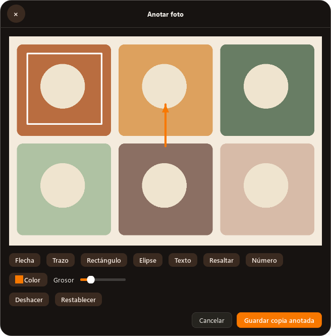
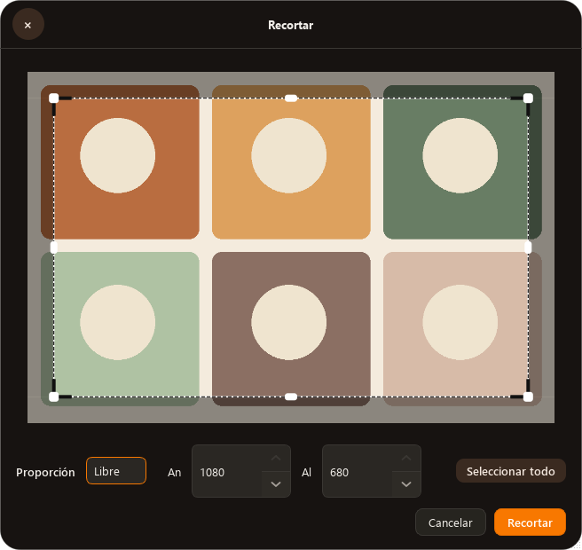
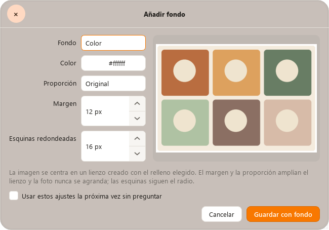

# Reparación de editores y selección múltiple — 1.10.1

## Causas reproducidas

| Síntoma | Causa en código | Cambio |
| --- | --- | --- |
| Annotate vacío | `self.width = 3` ocultaba `QWidget.width()`; fallaba `_layout()` al pintar | `stroke_width`, render y exportación comprobados |
| Solo se edita una imagen | El catálogo ocultaba herramientas múltiples y el dispatcher usaba `sources[0]` | Catálogo con ámbitos por formato; secuencia para geometría y lote compartido para fondo |
| Recorte solo desde esquinas | Detección y dibujo de cuatro vértices; sin ratio durante drag | Ocho tiradores, cursores direccionales, margen y ratio |
| Flechas numéricas pequeñas y superpuestas | Apariencia nativa de subcontroles dentro de QSS común | Controles Qt con botones independientes y texto reservado |
| PDF permite seleccionar una sola fila | `QListWidget` con modo predeterminado | Ctrl/Shift, mover grupos, añadir/quitar imágenes |

La selección recibida de Explorer, la rueda y el motor de conversión ya
transportaban listas. La pérdida identificada estaba en el catálogo y los
editores individuales. No se ha medido aquí una nueva selección interactiva en
Explorer; las comprobaciones se realizan en código y Qt offscreen.

## Componentes y contrato visual

| Componente | Archivo | Comportamiento |
| --- | --- | --- |
| Contenedor y cabecera | `editors/base.py` | Superficie cálida, botones consistentes, preferencia opcional |
| Lienzos | `editors/ui/canvas.py` | Imagen ajustada sin retener originales enormes; coordenadas de exportación originales |
| Tiradores | `CropCanvas` | Ocho zonas de interacción y cursores por eje |
| Campos numéricos | `editors/ui/controls.py`, `theme.py` | Botones de 32 px de ancho y al menos 24 px de alto; texto separado |
| Anotación | `editors/images.py` | Herramientas, fila de color/grosor, deshacer/reiniciar, copia PNG |
| Secuencia múltiple | `editors/batch.py`, `catalog.py` | Geometría por imagen; cancelar detiene editores pendientes |
| Opciones persistidas | `tool_defaults.py`, `settings_window.py` | Lista explícita de herramientas, validación y activación voluntaria |
| Progreso | `progress.py`, `main.py` | Trabajo en segundo plano, seguimiento y cierre al finalizar |
| Orden PDF | `editors/pdf.py` | Lista múltiple y movimiento de grupos sin perder archivos |

Se reutilizan los tokens de color, radios y botones existentes de Tangerine.
Estas superficies quedan en el mismo código y aplicación; no se crea una
utilidad paralela. Este inventario sirve como referencia para OpenDesign; no
afirma una publicación ni modificación de un proyecto remoto de diseño.

## Opciones guardadas

Aplicables a `img.compress`, `vid.compress`, `aud.compress`, `img.collage` y
`img.background`. `toolSkipOptions` comienza vacío. Marcar la casilla y cancelar
no activa la preferencia. La activación ocurre al aplicar ajustes válidos.
Una casilla en Ajustes permite volver a mostrar cada diálogo; también hay un
botón para restaurarlos todos. No se persisten selecciones, coordenadas de
recorte, anotaciones ni nombres de salida. Si el archivo de fondo desaparece
o deja de ser legible, se solicita configurar de nuevo.

## Verificación reproducible

Desde la raíz del repositorio:

```powershell
python -m pytest -q
python main.py --smoke-editors
python main.py --smoke-image-pdf
```

`--smoke-editors` fuerza Qt offscreen, crea imágenes y ajustes temporales y
escribe `%TEMP%/Tangerine-editors-smoke.json`. Comprueba:

- Imagen y operación renderizadas en Annotate; PNG exportado con píxeles modificados.
- Selector de proporción, ocho tiradores, arrastre y tamaño del archivo recortado.
- Clics reales sobre botones numéricos y separación entre ancho de widget y grosor.
- Dos copias de fondo con dimensiones verificadas; repetición con preferencias,
  sin entrar en `exec()`, y cierre automático de ambos progresos.

La misma orden se ejecuta sobre `Tangerine.exe` durante empaquetado y CI; un
fallo impide publicar el instalador. Los resultados de distribución e instalación
se documentan después de ejecutar esas fases; un render offscreen no equivale a
una comprobación interactiva de Explorer o del escritorio del usuario.

Referencias primarias consultadas: [selección Qt](https://doc.qt.io/qtforpython-6/PySide6/QtWidgets/QAbstractItemView.html),
[pasos numéricos Qt](https://doc.qt.io/qtforpython-6/PySide6/QtWidgets/QAbstractSpinBox.html),
[geometría QWidget](https://doc.qt.io/qtforpython-6/PySide6/QtWidgets/QWidget.html).

## Evidencia del código fuente

El 2026-10-09: `265 passed, 1 skipped` en 43.40 s. Compilación Python y análisis
sintáctico de `packaging/build.ps1` correctos. Las órdenes fuente
`python main.py --smoke-editors` y `python main.py --smoke-image-pdf` salieron
con código 0. Se usaron tres workers GPT-6 Luna para ramas independientes y
revisión adversarial; la integración y revisión final quedaron a cargo del
coordinador. No se utilizó Computer Use.

Renders Qt offscreen con fuentes instaladas de Windows cargadas explícitamente:






