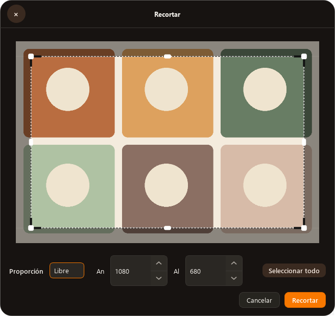

# Estado de botones después de sincronizar el lienzo — 1.10.2

La revisión visual final de 1.10.1 mostró que el valor de anchura cambiaba
después de un arrastre, pero el botón de aumento seguía con su estado anterior.
Dos pruebas reprodujeron el fallo en `NumericSpinBox` y `NumericDoubleSpinBox`:
máximo → bloquear señales → valor intermedio → flecha aún deshabilitada.

`CropImageDialog._rect_changed()` bloquea señales para no volver a ejecutar
el cambio de dimensiones. Los controles dependían exclusivamente de
`valueChanged` para refrescar sus botones. Ahora también sincronizan el estado
al cambiar el valor desde código, conservando el bloqueo de señales de Qt.

Las pruebas nuevas cubren la transición en enteros y decimales. El smoke del
ejecutable reproduce además arrastrar un recorte, sincronizar sus campos y
pulsar el botón de aumento. Esta comprobación se incorpora al empaquetado y
a la validación de la instalación.

1.10.1 permanece publicada con su etiqueta original; esta corrección se
distribuye como 1.10.2. Las demás reparaciones se describen en la
[auditoría anterior](editor-repair-1.10.1.md).

Verificación fuente del 2026-10-09: **269 passed, 1 skipped**, 38.21 s.
`python main.py --smoke-editors` terminó con código 0 e incluye la comprobación
`blocked_signal_refresh: true` y el clic después de arrastrar el recorte.

## Distribución e instalación verificadas

La [versión 1.10.2](https://github.com/CristianO2601/tangerine-windows/releases/tag/v1.10.2)
corresponde al commit `6a399f4b7e414f22d3e346b88dac1eb12997c5c1`.
La [CI del código](https://github.com/CristianO2601/tangerine-windows/actions/runs/37890684205)
terminó correctamente con **252 passed, 14 skipped**. El
[empaquetado de Windows](https://github.com/CristianO2601/tangerine-windows/actions/runs/37890686035)
terminó correctamente con **257 passed, 13 skipped**, la prueba nativa de la
extensión de Explorer y las comprobaciones del ejecutable empaquetado.

La instalación local del 2026-10-09 pasó las tres comprobaciones del ejecutable
instalado: editores, imágenes a PDF y WebEngine. El recibo de editores incluye
`blocked_signal_refresh: true`, ocho tiradores de recorte, anotación guardada y
dos imágenes procesadas con opciones compartidas, repetición de opciones
guardadas y cierre automático del progreso.

Los hashes SHA-256 del ejecutable y de `TangerineShell.dll` instalados coinciden
con los del ZIP publicado. Los ajustes del usuario se conservaron. Quedó una
sola instancia normal de Tangerine en ejecución.

La comprobación adicional con la API nativa `IContextMenu` encontró las tres
acciones de PDF e invocó `Tangerine.Pdf.Name` con dos PNG. El resultado fue
`INVOKE_RESULT=0x00000000` y un PDF nuevo de **dos páginas**, comprobado con
`pypdf`; el archivo no existía antes de invocar la acción.

Estas verificaciones cubren interacción Qt offscreen y la API nativa de Windows.
No se observó visualmente el menú de Explorer ni se utilizó Computer Use.
Los recibos locales están en
`build/ui-repair-evidence/20261009/hotfix-1.10.2/`, con el resumen en
`final-validation-receipt.json`. Los ajustes privados y sus copias no se publican.
