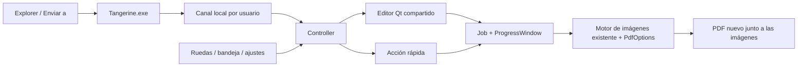
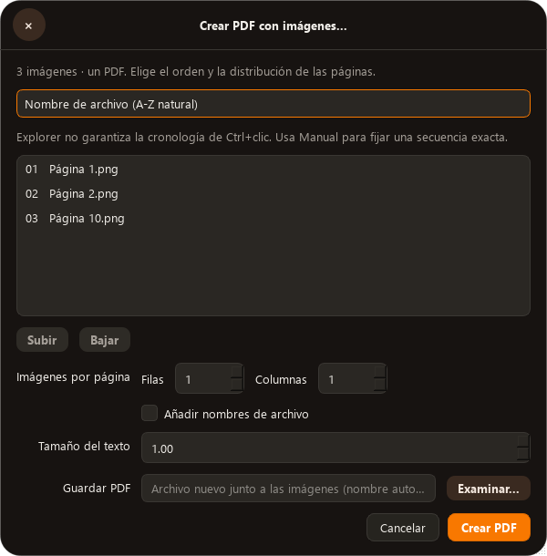
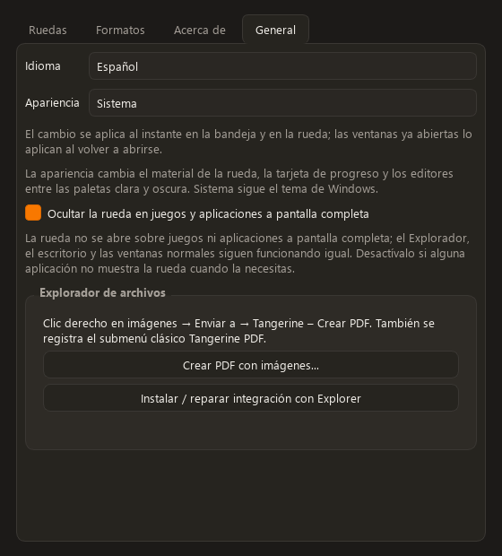

# Tangerine 1.10.0: imágenes a PDF

## Resultado y alcance

La conversión pertenece a Tangerine: un motor, un editor Qt, una tarjeta de
progreso y una instancia por usuario. No necesita Python, Tkinter ni una segunda
aplicación en el equipo de destino. La integración anterior independiente se
retira del registro únicamente si sus marcas de propiedad coinciden; sus
archivos se conservan y se guarda un respaldo JSON del registro.

La captura aportada por Cris demuestra que la entrada anterior no aparecía.
Crear un menú con una API auxiliar no prueba que Explorer lo muestre. El motivo
exacto de esa omisión sigue sin demostrarse: las políticas inspeccionadas no
exigen aprobación de extensiones y el CLSID anterior no está bloqueado. No se
atribuye el fallo a caché, arquitectura o permisos sin evidencia adicional.

## Entradas y flujo compartido

| Entrada | Comportamiento |
| --- | --- |
| Bandeja → Crear PDF con imágenes | Selector de imágenes y editor |
| Ajustes → General → Explorador de archivos | Editor y reparación del registro |
| Rueda de herramientas → Crear PDF | Editor con la selección actual |
| Rueda de conversiones → PDF, selección de imágenes | Un PDF combinado mediante el mismo editor |
| Clic derecho → Enviar a → Tangerine - Crear PDF | Editor con todos los argumentos recibidos |
| Clic derecho → Enviar a → Tangerine - PDF por nombre | Conversión rápida en orden natural |
| Submenú clásico Tangerine — PDF | Nombre natural, orden recibido o configuración manual |



El ejecutable secundario entrega la petición a la instancia abierta y termina.
El manejador nativo recibe toda la selección por `CF_HDROP` y escribe un
manifiesto UTF-8; no decodifica imágenes dentro de Explorer. La lista está
limitada a 10 000 rutas y menos de 8 MiB. El canal local valida el mensaje,
limita su tamaño, confirma recepción y evita procesar dos veces el mismo ID.

`Enviar a` proporciona una entrada mediante un menú que ya existe en Explorer.
La fila nativa de primer nivel requiere además que Explorer cargue la extensión.
Las pruebas del DLL y del registro no equivalen a una observación del menú real.
La comprobación final consultó también el menú combinado de Windows mediante
`SHParseDisplayName` → `SHBindToParent` → `IShellFolder::GetUIObjectOf` →
`IContextMenu`, sin mostrarlo. En selecciones simples y múltiples encontró la
etiqueta exacta `Tangerine — PDF` y los tres verbos propios. Invocó exclusivamente
`Tangerine.Pdf.Name` y validó los PDF resultantes. Esto comprueba el flujo Shell
→ DLL → manifiesto → ejecutable → instancia abierta → PDF; no observa la
presentación ni la caché del proceso `explorer.exe` del usuario.
La auditoría de solo lectura también comparó arquitectura, usuario, sesión y
nivel de integridad de Explorer y Tangerine, sin diferencias. No encontró el
CLSID propio bloqueado ni políticas de aprobación obligatoria en las claves
consultadas. El log y la instantánea de módulos todavía no muestran activación
desde `explorer.exe`; no se observó un clic derecho posterior a la instalación,
por lo que esa ausencia no demuestra un fallo actual. Los recibos son
`process-context-readonly-20261008-r2.json` y `explorer-shell-audit-readonly.json`.
La integración no reinicia Explorer ni cambia sus políticas globales.

## Orden, salida y errores

- Nombre natural: Página 1, Página 2, Página 10.
- Orden recibido: conserva la lista entregada por Windows. No se promete la
  cronología de Ctrl+clic; el orden exacto se puede fijar en Manual.
- Una imagen por página por defecto; cuadrícula por filas y columnas opcional.
- Nombres de archivo opcionales en una banda blanca, con escala del texto.
- Rotación EXIF y transparencia a fondo blanco mediante los codecs existentes.
- GIF e imágenes con varios fotogramas aportan su primer fotograma por archivo.
- La salida automática usa un nombre libre junto a las imágenes. Una salida
  explícita existente se rechaza; los originales no se sobrescriben.
- Reserva exclusiva del nombre, archivo temporal en la misma carpeta y
  publicación con `os.replace`. WinError 5/32 admite cinco reintentos con pausas
  que suman 1 s, con cancelación entre intentos. Se verifica la identidad de la
  reserva antes de reintentar y de borrar el placeholder. Los errores
  persistentes se muestran; la limpieza de un archivo aún bloqueado es de mejor
  esfuerzo y conserva el error original de conversión.
- La tarjeta compartida muestra avance, ofrece cancelar al pasar el puntero y
  se cierra después de publicar el PDF. Los errores permanecen visibles.
- El PDF conserva proporciones de las imágenes, a 150 dpi. Los ajustes A4/Carta
  de documentos son un flujo distinto. SVGZ no se anuncia como soportado.

## Componentes visuales reutilizables

| Componente | Implementación y criterio |
| --- | --- |
| Contenedor del editor | `ToolDialog`, esquinas redondas y material HUD existente |
| Tipografía y colores | `theme.py`, Segoe UI, paletas clara/oscura y acento Tangerine |
| Orden de páginas | Lista numerada, ruta completa en tooltip, modos nombre/recibido/manual |
| Reordenación | Chips Subir/Bajar, activos en modo Manual |
| Distribución y etiquetas | Controles Qt integrados en el formulario compartido |
| Acción principal | Botón naranja Crear PDF; validación junto al campo de salida |
| Progreso | `ProgressWindow`, barra naranja, anclaje al cursor y autocierre |
| Ajustes de Explorer | Acceso al editor y acción Instalar/reparar con resultado visible |

Estos son los componentes y estados que debe conservar una futura iteración en
OpenDesign. Los renders de revisión provienen de los widgets reales en modo
offscreen, con fuentes instaladas cargadas explícitamente. No se ha publicado
un diseño remoto ni se presenta una maqueta como ejecución real de Explorer.





## Validación reproducible

```powershell
python -m pytest -q
python main.py --smoke-image-pdf
powershell -NoProfile -ExecutionPolicy Bypass -File packaging\build.ps1
```

La comprobación `--smoke-image-pdf` usa archivos temporales y una cola aislada.
Crea PDF de una y tres imágenes, ejecuta el CLI en procesos secundarios reales,
entrega sus peticiones por el canal local a `Controller.handle_request`, valida
las páginas, la limpieza del manifiesto y el autocierre. No registra extensiones.

El build también compila y ejecuta `shell_selection_contract` mediante CTest:
selección simple, múltiple y filtrado de selección mixta/no compatible. No abre
un menú ni invoca un comando. El log nativo obtiene el nombre real del proceso;
un harness no se identifica como `explorer.exe`.

Las pruebas de registro y accesos directos usan una rama temporal de HKCU y una
carpeta SendTo temporal. Cubren lectura posterior, reparación repetida,
desinstalación propia y conservación de registros ajenos.

El workflow de GitHub ejecuta regresiones, build nativo, validaciones del
ejecutable congelado, exige instalador y comprueba que el tag coincida con la
versión antes de publicar. Incluye la reparación previa de Qt WebEngine/ICU
preparada para 1.9.2 y ahora incorporada en 1.10.0.

## Evidencia local de esta integración

- Cambios previos conservados: `build/integration-evidence/20261008-184557/before.diff`.
- Regresión final del motor con reintentos: 222 aprobadas, 1 omitida. El recibo
  se guarda en `build/integration-evidence/20261008-184557/pytest-publish-final.txt`.
  Los 23 casos del motor incluyen errores Windows simulados, persistencia,
  cancelación, sustitución de reserva y fallo de limpieza. No se presenta una
  simulación como reproducción del bloqueo real de Windows.
- Smoke de código fuente: `ok=true`, versión 1.10.0, 2 peticiones IPC, PDF de
  1 y 3 páginas, limpieza del manifiesto y autocierre confirmados.
- Renders de los widgets en español: carpeta local de evidencia, `pdf-True.png`,
  `pdf-False.png`, `settings-True.png`, `settings-False.png`.
- Paquete e instalación: `--smoke-webengine` y `--smoke-image-pdf` terminaron con
  código 0 tanto desde el bundle como desde `%LOCALAPPDATA%/Programs/Tangerine`.
  Los recibos `installed-webengine-smoke.log` e `installed-image-pdf-smoke.json`
  confirman WebEngine con sandbox activo, 2 peticiones IPC, PDF de 1 y 3 páginas,
  orden del editor, limpieza del manifiesto y autocierre.
- Instalador: código 0; su llamada `--register-shell` también terminó con 0.
  `installation-receipt.json` verifica versión, hashes, claves HKCU, accesos
  SendTo y de inicio automático, ajustes preservados y respaldo del registro
  independiente. Solo quedó ejecutándose Tangerine desde la instalación nueva.
- Shell completo: `shell-invoke-final.txt` y `shell-final-receipt.json` confirman
  menú para una y varias imágenes, etiqueta Unicode exacta, invocación nativa
  con código 0 y PDF de 1 y 2 páginas leídos con `pypdf`. No se usó Computer Use.
  La primera petición excedió el límite inicial de 15 s del probe y terminó
  después; la repetición y la prueba final completaron ambos casos en unos 5 s
  en total. No se atribuye esa primera demora a una causa no medida.
- Se detectó y corrigió un guion mal codificado por MSVC: `/utf-8`, literal
  Unicode y prueba nativa que exige la etiqueta exacta. Se reconstruyó la DLL
  y se regeneraron ZIP e instalador desde el mismo bundle validado.

Los hashes de EXE, DLL, ZIP e instalador se conservan en los recibos locales
`installation-receipt.json`, `portable-final-receipt.json` y
`release-local-hashes.json`. Cada nueva compilación exige volver a ejecutar las
comprobaciones del bundle y de la instalación; una prueba de código fuente no
valida un ejecutable anterior.

### Pruebas en GitHub

El primer runner instaló Qt 6.12.0; fijar la dependencia a la versión local
6.11.2 no resolvió por sí solo el abort de las pruebas. El render aislado pasó
en el mismo runner con Segoe UI cargada. La comparación A/B del run
[37866653643](https://github.com/CristianO2601/tangerine-windows/actions/runs/37866653643)
aisló la contaminación al test IPC: el archivo de pruebas fresco abortaba tras
ese caso, mientras la suite sin ese caso alcanzaba ambos renders.

El test cerraba únicamente el listener, dejando objetos Qt pendientes de
destrucción. Ahora destruye sockets y servidor, entrega `DeferredDelete` antes
de restaurar los monkeypatches y comprueba la destrucción de todos los sockets.
También elimina las ventanas Qt creadas por cada prueba antes de restaurar su
estado. No se modificó el servidor de producción para ocultar el fallo.

El run [37885535793](https://github.com/CristianO2601/tangerine-windows/actions/runs/37885535793)
del commit `f1b462d59c39e56975063be88cbd58fa1f1b308c` pasó la suite completa en
Windows/Python 3.12: 197 aprobadas y 14 omitidas, con IPC y renders incluidos.
El recibo local es `ci-ipc-cleanup.txt`. La relación con la limpieza del test
queda comprobada; no se atribuye el abort a una causa nativa más específica ni
a la diferencia entre Python 3.12 y 3.14 sin una prueba cruzada.

La comparación A/B detectó además un `WinError 5` real en `os.replace` durante
la publicación simultánea de dos PDF. Ese fallo se trata por separado en el
motor, conservando la reserva exclusiva y la publicación atómica.

La versión publicada usa el commit `2418d32ea570cabacf8f8b5965ebd1d71c51a6db`.
El [CI de ese código](https://github.com/CristianO2601/tangerine-windows/actions/runs/37885910123)
pasó 205 pruebas con 14 omitidas. El
[workflow de publicación](https://github.com/CristianO2601/tangerine-windows/actions/runs/37885942064)
terminó en verde: 14 casos de flujo PDF en una sesión fresca, suite completa
con OCR (210 aprobadas, 13 omitidas), contrato nativo CTest y comprobaciones
WebEngine/PDF del ejecutable congelado. Publicó
[Tangerine 1.10.0](https://github.com/CristianO2601/tangerine-windows/releases/tag/v1.10.0).

Se descargaron los dos activos publicados y se contrastaron sus SHA-256 con los
digests de GitHub; la comprobación CRC de todas las entradas del ZIP pasó.
`release-payload-receipt.json` conserva tamaños, hashes y commit de origen.

El artefacto de validación de ese run contenía los dos XML de pruebas, pero no
los logs de runtime: el proceso escribe en `%TEMP%` y el uploader buscaba en
`runner.temp`. El log completo del job sí conserva los resultados del runtime.
El workflow de la rama principal ahora copia esos dos archivos concretos desde
`$env:TEMP` a `build/validation` antes de subirlos; la misma secuencia PowerShell
se ejecutó localmente y produjo ambos archivos. Este ajuste de recolección no
modifica los binarios publicados.

### Instalación del artefacto publicado

Se instaló el instalador descargado de la release, con código 0 y registro del
Shell con código 0, sin reinicio. La lectura posterior confirmó EXE y DLL
idénticos al ZIP publicado, versión 1.10.0, accesos de bandeja/inicio/Enviar a,
ajustes preservados y migración propia con respaldo. El proceso activo quedó
en `%LOCALAPPDATA%/Programs/Tangerine/Tangerine.exe`; solo hay una instancia.

Desde esa instalación pasaron otra vez `--smoke-webengine` con sandbox activo
y `--smoke-image-pdf` (2 peticiones IPC, PDF de 1/3 páginas, editor y autocierre).
El probe real del Shell se compiló además para fixtures PNG y JPG válidos:
consultó selecciones simples, múltiples y mixtas. Luego invocó los cuatro casos
PNG/JPG simples/múltiples contra la instalación publicada. Todos devolvieron
HRESULT 0 y generaron PDF de 1, 2, 1 y 2 páginas, leídos con `pypdf`.

Los recibos finales son `install-published-exit.json`,
`installation-receipt.json`, `installed-published-webengine-smoke.log`,
`installed-published-image-pdf-smoke.json` y `published-shell-final-receipt.json`.
La presentación visual del menú en Explorer sigue sin observarse; la consulta
y la invocación se hicieron mediante las APIs del Shell, sin Computer Use.

| Archivo publicado o instalado | SHA-256 |
| --- | --- |
| Instalador | `34aca84fb69b366b48310614de40ab601e4d7af2bcc9a47b2b53fb21331cacbf` |
| ZIP portable | `4f23e8210240f7229af2e56c44d543e3555b4dab3acd39f0bea2dc4f3464aedb` |
| `Tangerine.exe` | `0195303d88071773299e4f506ce96df570ee68d8ee09956b32c1f9b50f7d72d1` |
| `TangerineShell.dll` | `096c873a095b19d243d9408f292ad600ecdf51c1204ab6969939da3006612168` |

### Bloqueo real de publicación en Windows

Además de las simulaciones unitarias, se abrió el placeholder mediante
`CreateFileW` con lectura y uso compartido READ/WRITE, omitiendo SHARE_DELETE.
El `os.replace` directo devolvió WinError 5 y conservó ambos archivos intactos.
El helper de producción del commit `2418d32` registró tres errores WinError 5;
tras liberar el handle a 0,252 s, publicó en el cuarto intento a 0,353 s.
El PDF resultante tiene una página y el mismo SHA-256 que el temporal original.

El recibo y el script ejecutado están en
`scratch/evidence/real_publish_lock_evidence.json` y
`scratch/evidence/real_publish_lock_probe.py`, dentro de la carpeta de evidencia.
Esto comprueba recuperación ante ese bloqueo controlado real. No identifica
qué proceso o condición causó el WinError 5 inicial del runner.

### Diagnóstico del build local

El primer paquete ejecutó correctamente imágenes a PDF, pero WebEngine terminó
con `STATUS_DLL_NOT_FOUND` al ejecutar sus procesos aislados desde el workspace.
La prueba temporal sin sandbox pasó; no se incorpora esa desactivación al app.
El mismo paquete copiado a `%LOCALAPPDATA%/TangerineValidation/20261008/Tangerine`
pasó con el sandbox activo. El helper del entorno Python también pasó.

La evidencia demuestra dependencia de la ubicación/entorno de ejecución, no una
DLL concreta ausente. El workspace y el destino tienen ACL distintas; atribuir
el fallo a una ACE específica todavía sería una inferencia. La compilación final
se valida en `%LOCALAPPDATA%/TangerineBuilds/1.10.0`, antes de instalar por usuario.
El ZIP/instalador transporta los archivos del paquete y usa permisos del destino.

## Fuentes revisadas el 2026-10-08

- [Gist original de nobucshirai](https://gist.github.com/nobucshirai/d5216fe9fa1b1fb719c05c880866cd66):
  comportamiento solicitado de combinación, cuadrícula y etiquetas. El motor
  nuevo implementa ese flujo usando las dependencias existentes de Tangerine.
- [Microsoft: Creating Shortcut Menu Handlers](https://learn.microsoft.com/en-us/windows/win32/shell/context-menu-handlers):
  interfaces de menú, activación y registro por usuario.
- [Microsoft: Verb Selection Model](https://learn.microsoft.com/en-us/windows/win32/shell/how-to-employ-the-verb-selection-model):
  selección múltiple y modelos de invocación.
- [Qt: QLocalServer](https://doc.qt.io/qtforpython-6/PySide6/QtNetwork/QLocalServer.html):
  canal local y opción de acceso por usuario.
